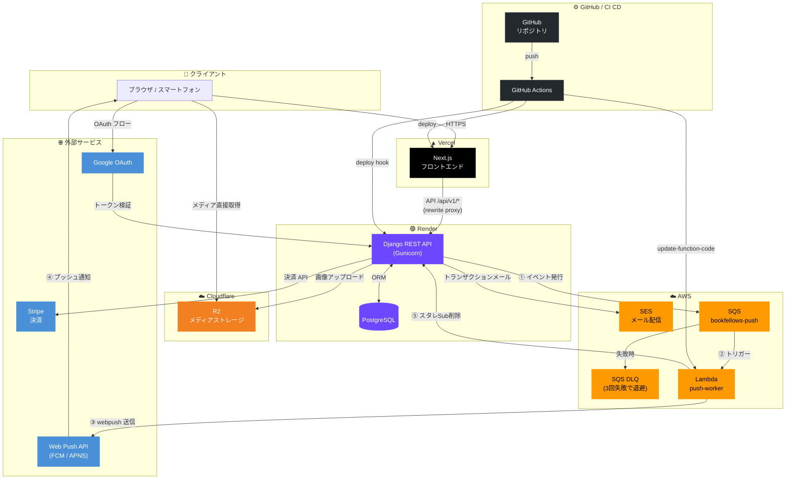

# BookFellows インフラ構成図

## フローの補足

| フロー | 同期 / 非同期 |
|---|---|
| ブラウザ → Vercel → Django | 同期 |
| Django → Cloudflare R2 | 同期 |
| Django → AWS SES / Stripe | 同期 |
| Django → SQS → Lambda → Web Push | 非同期 |
| GitHub Actions → Vercel / Render / Lambda | 非同期（CD） |
