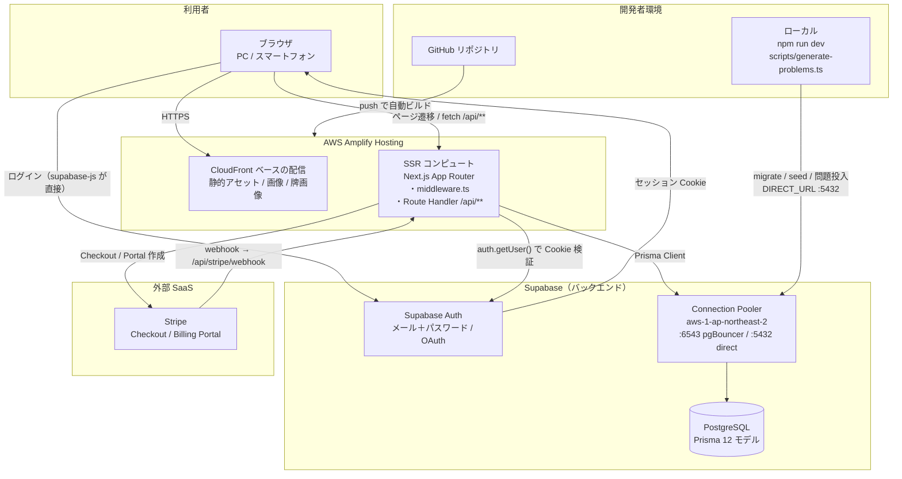
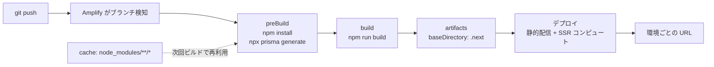
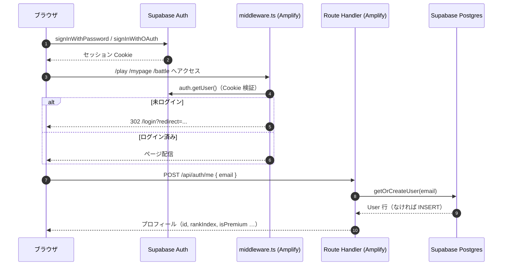
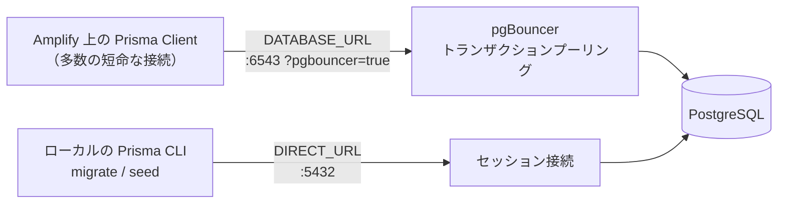
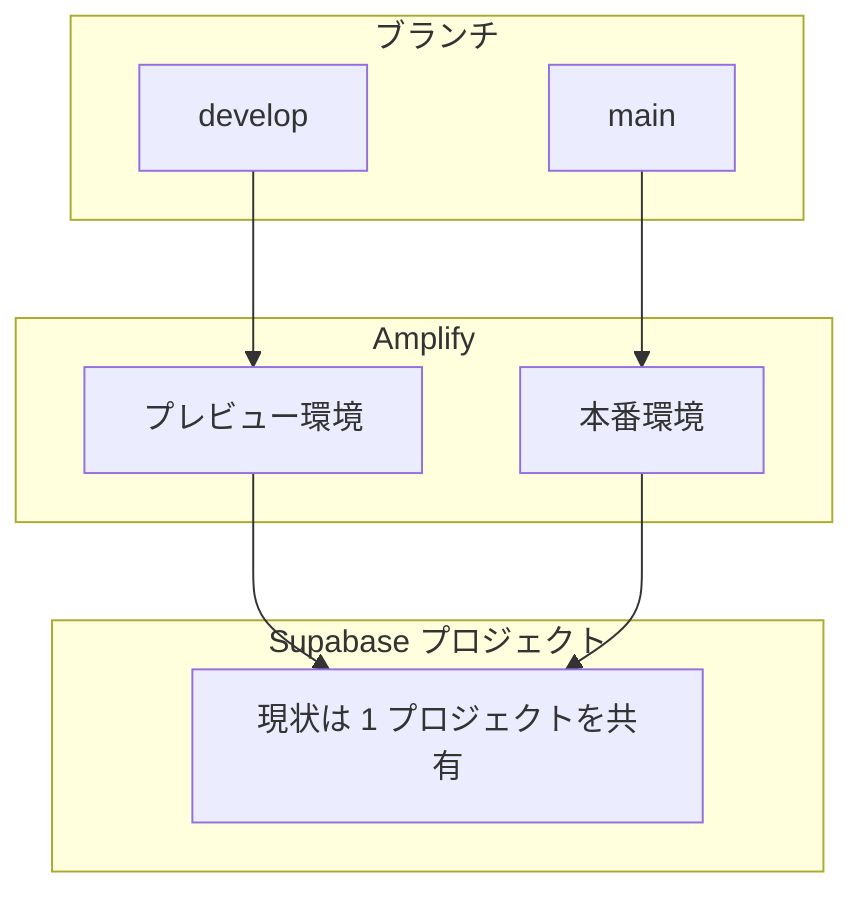

# インフラ構成

フロントエンド（Next.js）は **AWS Amplify Hosting**、バックエンド（DB / 認証）は **Supabase**、課金は **Stripe** という 3 者構成。
アプリ自体は Next.js 15 App Router の単一プロジェクトで、サーバー処理（Route Handler）も Amplify 側の SSR コンピュートで動く。

- コード構成の詳細（API・データモデル・画面の関係）は別途アーキテクチャ資料を参照
- ここでは「どこで動いていて、何につながっているか」だけを扱う

---

## 1. 全体像



**押さえどころ**

| 経路 | 内容 |
| --- | --- |
| ブラウザ → Supabase Auth | ログインだけはブラウザから直接。Amplify を経由しない |
| ブラウザ → Amplify → Supabase DB | それ以外のデータは全部 `/api/**` 経由。DB への接続は Prisma のみ |
| Stripe → Amplify | webhook は Stripe からの受信。署名検証に `STRIPE_WEBHOOK_SECRET` を使う |
| ローカル → Supabase DB | マイグレーションと問題データ投入は開発者のマシンから直接 |

---

## 2. デプロイパイプライン

`amplify.yml` の内容そのまま。



- `npx prisma generate` を preBuild で回しているので、**Prisma Client はビルド時に生成される**（リポジトリにコミットしない前提）
- ビルドコンテナから DB への接続は不要。`prisma generate` はスキーマだけを見る
- マイグレーション（`prisma migrate deploy`）はパイプラインに**入っていない**。スキーマ変更時は手動適用が必要

---

## 3. 認証とセッションの流れ



- Supabase Auth のユーザーと DB の `User` は**別レコード**で、連結キーは `email` のみ（UUID は保存していない）
- middleware の `matcher` は `/play` `/mypage` `/battle` の 3 パスだけ。`/api/**` は対象外

---

## 4. DB 接続の 2 系統

Supabase の Pooler にポート違いで 2 本つないでいる。



| 変数 | ポート | 用途 | なぜ分けるか |
| --- | --- | --- | --- |
| `DATABASE_URL` | 6543 | アプリの通常クエリ | SSR は接続が短命かつ多いのでプーリングが要る |
| `DIRECT_URL` | 5432 | `prisma migrate` / `db seed` | DDL とアドバイザリロックは pgBouncer 越しでは動かない |

`prisma/schema.prisma` の `datasource` が両方を宣言している。

---

## 5. 環境変数

| 変数 | 置き場所 | 用途 |
| --- | --- | --- |
| `NEXT_PUBLIC_SUPABASE_URL` | Amplify 環境変数 / `.env` | ブラウザ・middleware 双方から Supabase Auth へ |
| `NEXT_PUBLIC_SUPABASE_ANON_KEY` | 同上 | 同上（公開キー） |
| `DATABASE_URL` | 同上（**サーバー専用**） | Prisma からのクエリ |
| `DIRECT_URL` | 同上（**サーバー専用**） | マイグレーション・シード |
| `ADMIN_EMAILS` | 同上 | カンマ区切り。一致した email を `userType=2` に昇格 |
| `STRIPE_SECRET_KEY` | 同上 | Checkout / Portal セッション作成 |
| `STRIPE_WEBHOOK_SECRET` | 同上 | webhook の署名検証 |
| `STRIPE_PRICE_ID_MONTHLY` | 同上 | 月額プランの Price ID |
| `NEXT_PUBLIC_STRIPE_PUBLISHABLE_KEY` | 同上 | ブラウザ側の Stripe |

`NEXT_PUBLIC_` 接頭辞のあるものはビルド時にバンドルへ埋め込まれ、ブラウザから見える。それ以外は絶対に付けない。

---

## 6. 環境



現状 Supabase プロジェクトは 1 つで、ブランチを分けても**同じ DB を見る**。検証データが本番ランキングに混ざるため、環境ごとにプロジェクトを分けるか、少なくとも本番投入前にシードデータを整理する運用が要る。

---

## 7. 運用メモ

### スキーマを変更したとき

```bash
# ローカルでマイグレーション作成・適用（DIRECT_URL を使う）
npx prisma migrate dev --name <変更内容>

# 本番 DB に適用
npx prisma migrate deploy
```

Amplify のビルドでは適用されないので、**デプロイ前に手で流す**。
未適用のまま新コードがデプロイされると、存在しないカラムを参照して 500 になる。

### 問題データの投入

```bash
npx prisma db seed                      # 初期データ
npm run generate-problems:dry           # 生成と検証のみ
npm run generate-problems               # 検証を通した問題を DB に INSERT
```

### ローカル起動

```bash
npm install
npx prisma generate
npm run dev        # http://localhost:3000
```

`.env` が Supabase の生きているプロジェクトを指している必要がある。
指していない場合、静的なページ（`/rules` `/score-table` `/yaku-list` など）と `/api/generate-problem` は動くが、DB を使う API は `PrismaClientInitializationError` で 500 になる。

---

## 8. 気になっている点

| 論点 | 状況 | 対応案 |
| --- | --- | --- |
| マイグレーションが手動 | `amplify.yml` に `migrate deploy` がない | ビルド後フックに追加するか、手順を明文化する |
| 環境が DB を共有 | プレビューも本番も同じ Supabase プロジェクト | Supabase プロジェクトを環境ごとに分ける |
| `output: "standalone"` | `next.config.ts` で指定しているが、Amplify の Next.js SSR ビルドは `.next` をそのまま使う | Amplify 側の想定と噛み合っているか要確認。不要なら外す |
| `allowedOrigins: ["*"]` | Server Actions のオリジン制限が全開放 | 実際のドメインに絞る |
| 対戦のポーリング | 2 秒間隔の `GET /api/battle/[id]` が対戦人数分 DB に届く | 同時対戦数が増えたら Supabase Realtime へ寄せる |
| API の認可 | `/api/**` は middleware の対象外で、各ハンドラも受け取った email をそのまま信用している | サーバー側でセッションと突き合わせる共通処理を入れる |
