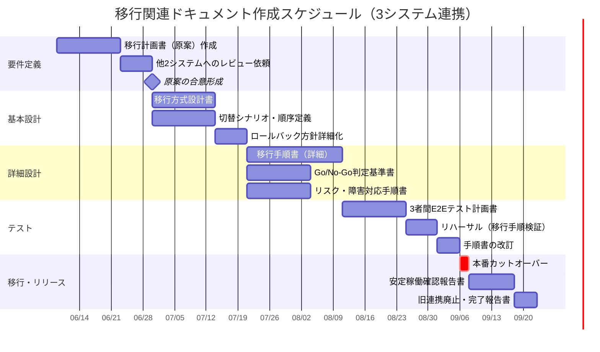

# 移行スケジュール

```mermaid
gantt
    title 移行関連ドキュメント作成スケジュール（3システム連携）
    dateFormat YYYY-MM-DD
    axisFormat %m/%d

    section 要件定義
    移行計画書（原案）作成 :a1, 2026-06-09, 14d
    他2システムへのレビュー依頼 :a2, after a1, 7d
    原案の合意形成 :milestone, m1, after a2, 0d

    section 基本設計
    移行方式設計書 :b1, after a2, 14d
    切替シナリオ・順序定義 :b2, after a2, 14d
    ロールバック方針詳細化 :b3, after b1, 7d

    section 詳細設計
    移行手順書（詳細） :c1, after b3, 21d
    Go/No-Go判定基準書 :c2, after b3, 14d
    リスク・障害対応手順書 :c3, after b3, 14d

    section テスト
    3者間E2Eテスト計画書 :d1, after c1, 14d
    リハーサル（移行手順検証） :d2, after d1, 7d
    手順書の改訂 :d3, after d2, 5d

    section 移行・リリース
    本番カットオーバー :crit, e1, after d3, 2d
    安定稼働確認報告書 :e2, after e1, 10d
    旧連携廃止・完了報告書 :e3, after e2, 5d
```
