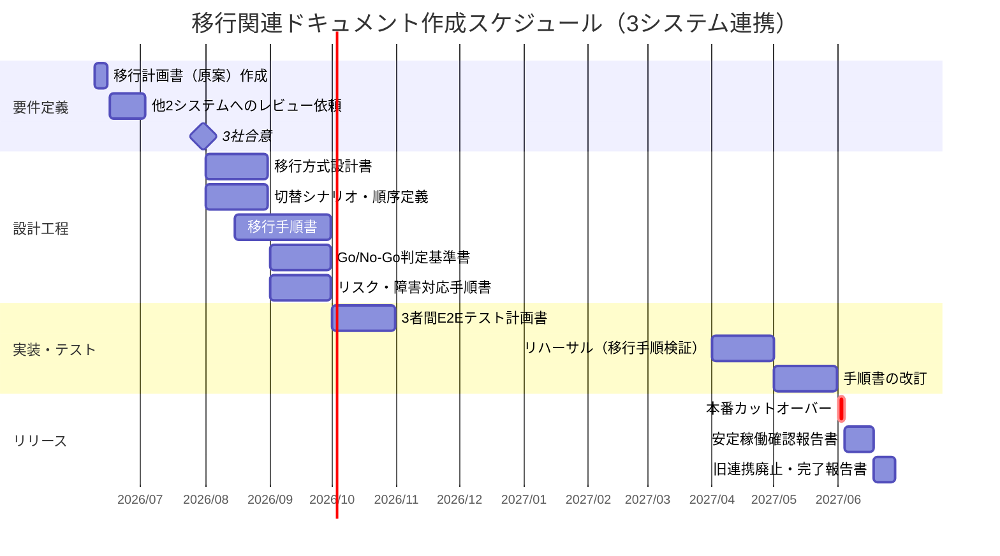

# 移行スケジュール

```mermaid
gantt
    title 移行関連ドキュメント作成スケジュール（3システム連携）
    dateFormat YYYY-MM-DD
    axisFormat %Y/%m

    section 要件定義
    移行計画書（原案）作成 :a1, 2026-06-09, 2026-06-15
    他2システムへのレビュー依頼 :a2, 2026-06-16, 2026-07-03
    3社合意 :milestone, m1, 2026-07-31, 0d

    section 設計工程
    移行方式設計書 :b1, 2026-08-01, 30d
    切替シナリオ・順序定義 :b2, 2026-08-01, 30d
    移行手順書 :b3, 2026-08-15, 2026-09-30
    Go/No-Go判定基準書 :b4, 2026-09-01, 2026-09-30
    リスク・障害対応手順書 :b5, 2026-09-01, 2026-09-30

    section 実装・テスト
    3者間E2Eテスト計画書 :c1, 2026-10-01, 30d
    リハーサル（移行手順検証） :c2, 2027-04-01, 30d
    手順書の改訂 :c3, 2027-05-01, 2027-05-31

    section リリース
    本番カットオーバー :crit, d1, 2027-06-01, 3d
    安定稼働確認報告書 :d2, 2027-06-04, 14d
    旧連携廃止・完了報告書 :d3, 2027-06-18, 10d
```
